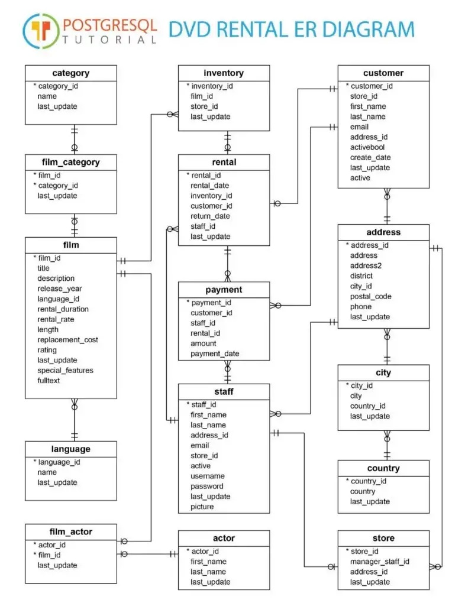

# DVD-Rental-SQL-Test
Basados en un modelo de datos clásico de Microsoft (DVD Rental), que se puede ver al final de
este documento, resuelva con SQL las siguientes consultas:
1. Listar los cinco clientes que más han pagado por alquilar DVD de películas de terror (o
un género cualquiera específico).
2. Listar los cuatro actores (nombre y apellido) que más películas filmaron en el último año.
3. Listar los tres clientes (nombre, apellido y fecha de creación) que más películas
alquilaron y los tres que menos alquilaron.
4. Listar la cantidad de películas en el inventario para cada tienda.
5. Listar el Top tres de vendedores (staff) para cada una de las tiendas.
6. Listar el acumulado por día de pagos en un mes para un cliente.
7. Listar la película que más se rentó por cada categoría.
8. Contar el número de clientes por país.
9. Cantidad y promedio de películas por lenguaje en cada categoría.
10. Determinar el primero y segundo mayor fan de cada actor (de acuerdo a los clientes que alquilaron el mayor número de películas en donde estos actores participaron).

 
 

